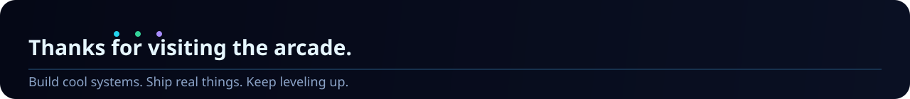

<!--
PROFILE README PACKAGE: Iyanu's Robotics Arcade
Repository name should match your GitHub username: Iyanuoluwa007
Update project links below if your public repo names differ.
-->

  

<h1 align="center">🎮 Iyanu's Robotics Arcade</h1>

<strong>Building robots, vision systems, and intelligent tools.</strong>

  
  
  

  
  

  

## 🕹️ Press Start

Hi, I'm **Iyanuoluwa Enoch Oke**.

I build **robotics, perception, and AI systems** with a focus on practical engineering. My work spans **ROS 2, computer vision, SLAM, simulation, automation, and intelligent tooling**.

This profile is designed like a small arcade hub: short, visual, and easy to scan.

---

## 👤 Player Profile

<table>
  <tr>
    <td><strong>Player Name</strong></td>
    <td>Iyanuoluwa Enoch Oke</td>
  </tr>
  <tr>
    <td><strong>Role</strong></td>
    <td>Robotics Software Engineer</td>
  </tr>
  <tr>
    <td><strong>Current Base</strong></td>
    <td>Manchester, United Kingdom</td>
  </tr>
  <tr>
    <td><strong>Main Loadout</strong></td>
    <td>ROS 2, Python, C++, OpenCV, YOLO, Docker, GitHub Actions</td>
  </tr>
  <tr>
    <td><strong>Current Quest</strong></td>
    <td>Building applied autonomy, computer vision, and AI-driven engineering systems</td>
  </tr>
  <tr>
    <td><strong>Open To</strong></td>
    <td>Robotics, Perception, Computer Vision, AI Systems, Embedded and Autonomous Engineering roles</td>
  </tr>
</table>

---

## 🧩 Levels Unlocked

| Level | Domain | What I Do |
|---|---|---|
| 01 | 🤖 Robotics | Build software for autonomous and intelligent robotic systems |
| 02 | 👁️ Computer Vision | Work on object detection, tracking, and perception pipelines |
| 03 | 🗺️ ROS 2 + SLAM | Develop modular robotic systems for mapping, navigation, and middleware integration |
| 04 | 🧠 AI Systems | Build intelligent tools, local RAG systems, and workflow automation |
| 05 | 🧪 Simulation | Use simulators and test environments to validate robot behaviour before deployment |

### XP Bars

- **Robotics:** 🟩🟩🟩🟩🟩⬜
- **Computer Vision:** 🟩🟩🟩🟩🟩⬜
- **ROS 2 / SLAM:** 🟩🟩🟩🟩⬜⬜
- **AI Systems:** 🟩🟩🟩🟩🟩⬜
- **Simulation & Tooling:** 🟩🟩🟩🟩⬜⬜

---

## 👾 Boss Projects

> A small number of strong projects beats a long list of random repos.

<table>
  <tr>
    <th>Mission</th>
    <th>What It Does</th>
    <th>Stack</th>
    <th>Link</th>
  </tr>
  <tr>
    <td><strong>Autonomous Robot Perception</strong></td>
    <td>Real-time perception system using object detection and tracking for mobile robotics. Built around the same computer vision direction that shaped my MSc final project.</td>
    <td>ROS 2, Python, OpenCV, YOLO, Tracking</td>
    <td><a href="https://github.com/Iyanuoluwa007">Add repo link</a></td>
  </tr>
  <tr>
    <td><strong>AutoResearcher</strong></td>
    <td>Local RAG assistant that reads PDFs, builds a vector store, and answers questions with local models.</td>
    <td>Python, LangChain, Ollama, Streamlit, Chroma</td>
    <td><a href="https://github.com/Iyanuoluwa007/AutoResearcher">Open</a></td>
  </tr>
  <tr>
    <td><strong>Signlytic AI</strong></td>
    <td>Sign language and AI communication tooling focused on accessible human-computer interaction.</td>
    <td>Python, CV, Speech, 3D Avatar Pipeline</td>
    <td><a href="https://github.com/Iyanuoluwa007">Add repo link</a></td>
  </tr>
  <tr>
    <td><strong>Quant Agent</strong></td>
    <td>AI-assisted quant engineering showcase with dashboards, analytics, and modular automation ideas.</td>
    <td>Python, APIs, Dashboards, Automation</td>
    <td><a href="https://github.com/Iyanuoluwa007">Add repo link</a></td>
  </tr>
</table>

---

## 📡 Mission Status

- 🔧 **Currently building:** Robotics, AI, and perception systems with strong engineering structure
- 🧪 **Currently exploring:** More advanced autonomy, agent workflows, and simulation-first development
- 🚀 **Current style:** Build first, measure properly, then refine
- 🎯 **Available for:** Robotics software, computer vision, SLAM, autonomy, and AI engineering opportunities

---

## 🛠️ Tech Loadout

  

---

## 🟩 Arcade Activity

  <picture>
    <source media="(prefers-color-scheme: dark)" srcset="https://raw.githubusercontent.com/Iyanuoluwa007/Iyanuoluwa007/output/github-snake-dark.svg" />
    <source media="(prefers-color-scheme: light)" srcset="https://raw.githubusercontent.com/Iyanuoluwa007/Iyanuoluwa007/output/github-snake.svg" />
    
  </picture>

  Animated automatically by GitHub Actions after you enable the workflow in this package.

---

## 🔗 Continue?

  <a href="https://www.linkedin.com/in/iyanuoluwa-enoch-oke/">LinkedIn</a> •
  <a href="mailto:oke.iyanuoluwa12@gmail.com">Email</a> •
  <a href="https://github.com/Iyanuoluwa007">GitHub</a>

  

